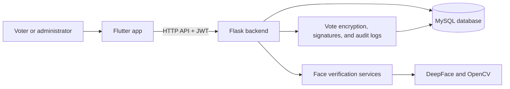

# Secure Electronic Voting System

A research and development project for an electronic voting workflow with a Flutter client and a Flask API. The backend manages voters, elections, candidates, authentication, vote submission, and administrative reports. Voter authentication can use a face-verification pipeline, and vote-submission code includes encryption and signing mechanisms.

> **Status and security notice:** This repository is a development/research project, not a certified election system. Do not use it for a real election or store real voter/biometric data without an independent security, privacy, operational, and legal review. The repository has previously tracked an RSA private key; treat that key as compromised, rotate it, and do not reuse it for production.

## Features

- Flutter application for voter sign-in, face-verification flow, elections, and voting.
- Flask REST API with voter and administrator routes.
- Voter registration and administration, election/candidate management, dashboards, and reports.
- Configurable face pipeline covering image quality, face tracking, liveness, anti-spoof/deepfake checks, and strict DeepFace identity embeddings.
- Vote validation, duplicate-vote prevention, encrypted vote payloads, signatures, and audit/security logs.
- MySQL schema and Docker Compose configuration for development/deployment experiments.

## Architecture



## Technology

- **Backend:** Python 3.11, Flask, SQLAlchemy, Flask-Migrate, JWT, MySQL/PyMySQL.
- **Face verification:** DeepFace, TensorFlow/tf-keras, OpenCV contrib, and MTCNN.
- **Frontend:** Flutter/Dart, Provider, camera, and Google ML Kit face detection.
- **Tests:** pytest for backend; Flutter test for frontend.

## Prerequisites

- Python 3.11 for the backend and face-verification dependencies.
- MySQL 8 (or a compatible MySQL server).
- Flutter SDK (Dart 3 or newer) for the client.
- A webcam/camera for live face capture. DeepFace may download model weights the first time it runs; keep these local and out of Git.

## Local development

### 1. Configure MySQL and backend environment

Create the `voting_system` database and apply the schema from [`backend/database/schema.sql`](backend/database/schema.sql). The Flask app can create missing tables after connecting, but the MySQL database itself must already exist.

Create a `.env` file in the repository root (it is git-ignored) and configure values appropriate for your local database and machine. For example:

```dotenv
DATABASE_URL=mysql+pymysql://<user>:<password>@localhost:3306/voting_system
SECRET_KEY=<random-development-secret>
JWT_SECRET_KEY=<different-random-development-secret>
AES_KEY=<32-or-more-random-characters>
ADMIN_USERNAME=<local-admin-name>
ADMIN_PASSWORD=<strong-local-only-password>
```

Do not commit `.env`, credentials, private keys, voter images, or model weights. Override all development defaults before running outside a private local environment. The backend can generate an RSA key pair locally; use a secure, persistent key-management solution in any real deployment.

### 2. Install and start the backend (PowerShell)

From the repository root:

```powershell
py -3.11 -m venv .venv
.\.venv\Scripts\Activate.ps1
python -m pip install --upgrade pip
python -m pip install -r backend/requirements.txt
python -m backend.run
```

The development API listens at `http://127.0.0.1:5000`. Check `http://127.0.0.1:5000/health` for the health endpoint. The first face-verification request may take longer while DeepFace/TensorFlow initializes or downloads model files.

The backend reads `.env` values such as `DATABASE_URL`, `SECRET_KEY`, `JWT_SECRET_KEY`, `AES_KEY`, `ADMIN_USERNAME`, and `ADMIN_PASSWORD`. Face-verification settings can also be adjusted in `backend/config.py` or through environment variables, including `DEEPFACE_MODEL`, `DEEPFACE_DETECTOR`, `DEEPFACE_DISTANCE_METRIC`, `DEEPFACE_TIMEOUT_SECONDS`, and `FACE_THRESHOLD`.

### 3. Start the Flutter app

In a second terminal:

```powershell
Set-Location frontend
flutter pub get
flutter run --dart-define=API_BASE_URL=http://localhost:5000
```

For an Android emulator, the host machine is usually reachable at `http://10.0.2.2:5000`; for a physical device, use the development computer's LAN address and ensure the firewall allows access. Configure camera permissions on the target platform.

## Tests

From the repository root, run the backend tests:

```powershell
.\.venv\Scripts\Activate.ps1
python -m pytest backend/tests
```

Run Flutter tests from `frontend`:

```powershell
Set-Location frontend
flutter test
```

Some integration tests may require a configured database or other local services; check the test setup when a test reports a missing prerequisite.

## Repository map

- `backend/` — Flask application, API routes, models, authentication, voting, and tests.
- `frontend/` — Flutter application for voters and administrators.
- `database/` and `backend/database/` — SQL schemas, migrations, and database utilities.
- `deployment/` — Docker and Nginx deployment experiments.
- `docs/` — design and thesis material.
- `datasets/`, `ai_models/`, and `backend/tmp/` — local development data/model locations; do not add personal biometric data or downloaded model weights to Git.

## Security and privacy

- Use synthetic test records and consented test images only. Protect biometric images and embeddings as sensitive personal data.
- Never publish `.env` files, passwords, signing keys, production data, or DeepFace model caches.
- Rotate the previously tracked RSA private key before any trusted use. Removing a key from the latest commit does not erase it from Git history; treat it as exposed and rotate it even if it is later removed from history.
- The face pipeline and vote-protection mechanisms have not been independently audited or certified. Do not treat them as a guarantee of election security.
